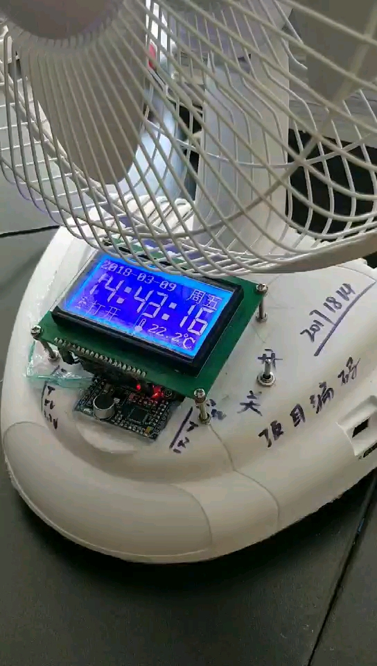

# 🌬️ 智能语音风扇 (Intelligent Voice Fan)

> 一个基于语音交互的智能风扇控制系统，支持语音调速、环境监测及信息显示。

## 📖 项目简介

本项目旨在设计一款具备人机交互功能的智能风扇。通过集成语音识别模块、温湿度传感器及显示屏，实现了“动口不动手”的便捷操作体验，同时能够实时反馈环境状态，适合作为物联网入门或嵌入式课程设计参考。

## 📺 项目演示

**视频演示地址：** [点击观看 Youku 视频](https://v.youku.com/v_show/id_XNDEyNzQ3MDE3Ng==.html)



## ✨ 主要功能

本项目包含以下四大核心功能：

1.  **🗣️ 语音控制风速**
    * 支持多档位语音调节（如：“打开风扇”、“一档”、“二档”、“关闭风扇”）。
    * 无需物理按键，彻底解放双手。

2.  **🔊 语音交互播报**
    * 操作成功后的语音反馈（如：“正在为您打开风扇”）。
    * 支持整点报时或特定状态下的语音提示。

3.  **📅 时间日期显示**
    * 实时显示当前的年、月、日、时、分、秒。
    * 支持断电走时（需配合 RTC 模块）。

4.  **🌡️ 环境温度监测**
    * 实时采集并显示室内环境温度。
    * 数据通过屏幕直观展示。

## 🛠️ 硬件清单 (示例，请根据实际情况修改)

| 硬件名称 | 型号/规格 | 备注 |
| :--- | :--- | :--- |
| 主控芯片 | STM32 / Arduino / 51单片机 | (请填写具体型号) |
| 语音模块 | LD3320 / SU-03T | 用于语音识别与播报 |
| 显示屏 | OLED 0.96寸 / LCD1602 | I2C/SPI 接口 |
| 温度传感器 | DS18B20 / DHT11 | |
| 时钟模块 | DS1302 / 内部RTC | |
| 电机驱动 | L298N / MOS管模块 | |
| 风扇 | 5V/12V 直流风扇 | |

## 🔌 引脚连接说明

> 请在此处简要说明各模块与主控板的连接方式，方便他人复刻。

* **语音模块 (RX/TX)** -> `PA9/PA10`
* **OLED (SCL/SDA)** -> `PB6/PB7`
* **温度传感器** -> `PA0`
* **风扇控制 PWM** -> `PA1`

## 🚀 快速开始

1.  **克隆仓库**
    ```bash
    git clone [https://github.com/Eaglewzw/Intelligent-voice-fan.git](https://github.com/Eaglewzw/Intelligent-voice-fan.git)
    ```
2.  **硬件连接**
    * 按照上述引脚说明连接各模块。
3.  **烧录程序**
    * 使用 Keil/Arduino IDE 打开工程文件。
    * 编译并下载至开发板。
4.  **开始使用**
    * 上电后，对着模块说出唤醒词（如“小智小智”），即可开始控制。

## 🤝 贡献与反馈

如果您有任何改进建议或发现了 Bug，欢迎提交 Issue 或 Pull Request。

## 📄 版权说明

本项目采用 MIT 协议开源。